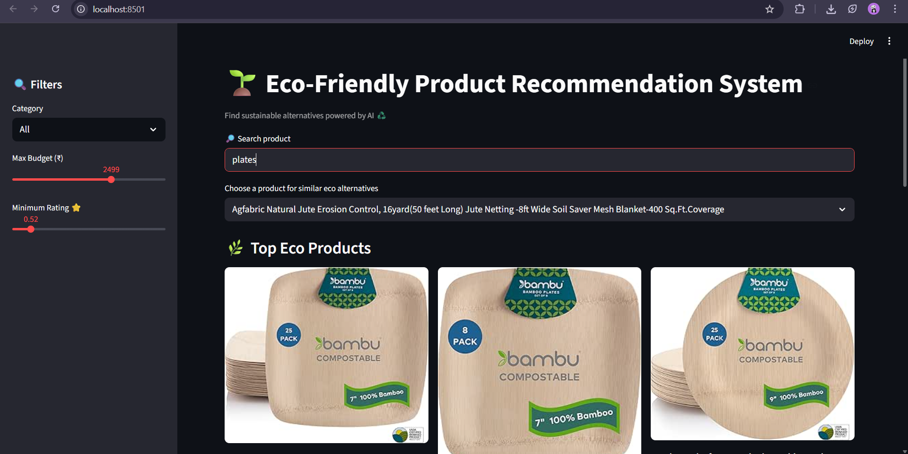
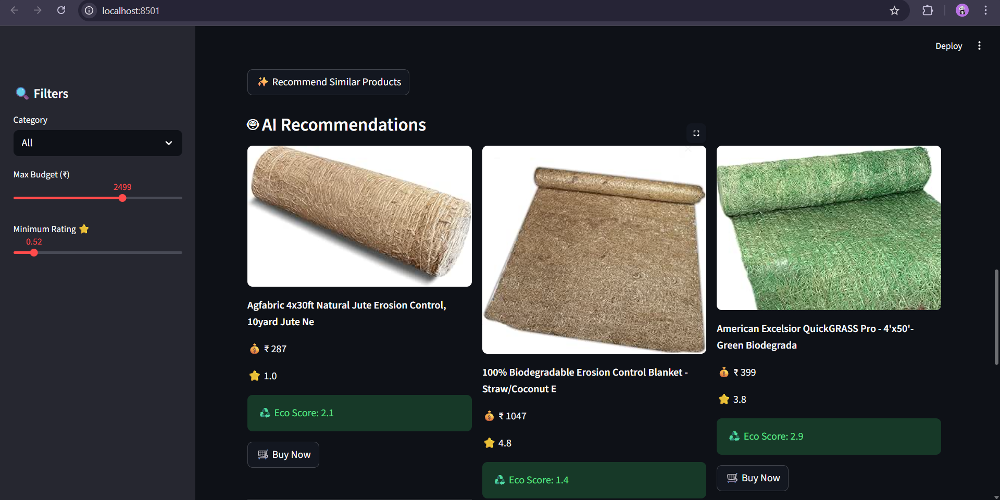
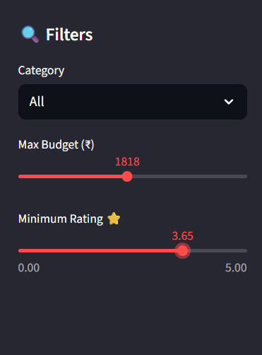

# 🌱 EcoSmart Recommender
AI-Based Eco-Friendly Product Recommendation System

## 📌 Overview
EcoSmart Recommender is a machine learning based web application that suggests sustainable and eco-friendly products to users.  
It analyzes product descriptions using Natural Language Processing (TF-IDF + Cosine Similarity) and recommends similar green alternatives.

The system also calculates an Eco Score (0–10) to rank products based on sustainability.

---

## 🚀 Features
- AI based product recommendation
- Eco score calculation (0–10 scale)
- Product similarity matching
- Category & budget filters
- Product images
- Direct purchase links
- Streamlit web interface

---

## 🧠 How It Works

1. Load Kaggle product dataset
2. Clean and preprocess data using Pandas
3. Convert product text → TF-IDF vectors
4. Compute cosine similarity between products
5. Recommend top similar eco products
6. Display results using Streamlit

---

## 📸 Application Screenshots

### 🏠 Home Interface


### 🤖 AI Recommendations


### 🔍 Filters & Search


---

## 🌱 Eco Score Calculation

Eco score is calculated by:
- Detecting sustainability keywords (bamboo, reusable, biodegradable, etc.)
- Counting keyword matches
- Normalizing to a 0–10 scale

Higher score → More eco-friendly

---

## 🛠 Tech Stack
- Python
- Pandas
- Scikit-learn
- TF-IDF
- Cosine Similarity
- Streamlit
- Matplotlib

---

## 📂 Project StructureEco-Friendly-Product-Recommendation-System/
```
Eco-Friendly-Product-Recommendation-System/
│
├── data/
│ └── amazon_eco_friendly_products.csv
│
├── notebooks/
│ ├── data_exploration.ipynb
│ └── train_model.ipynb
│
├── models/
│ ├── similarity.pkl
│ └── products.pkl
│
├── app/
│ └── app.py
│
├── assets/
│ ├── ui_screenshots/
│ └── eco_score_visual.png
│
├── requirements.txt
└── README.md
```


---

## ▶️ How to Run the Project

1. Clone the repository:
   ```bash
   git clone https://github.com/your-username/Eco-Friendly-Product-Recommendation-System.git
   ```
2. Navigate to the project directory:
   ```
   cd Eco-Friendly-Product-Recommendation-System
   ```
3. Install dependencies:
   ```
   pip install -r requirements.txt
   ```
4. Run the Streamlit app:
   ```
   streamlit run app/app.py
   ```
---
## 📌 Use Cases

- Sustainable shopping assistants
- Green product discovery platforms
- AI-powered e-commerce recommendation systems
- Environmental awareness applications

---
## 🙌 Acknowledgements

- Kaggle for the dataset

- Streamlit for the web framework

- Scikit-learn for machine learning utilities


